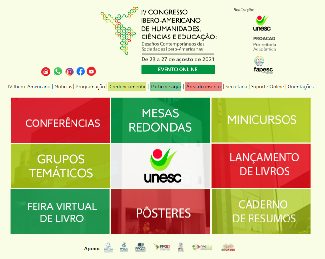

 

  

  <h3 align="center">Leia me</h3>

 

 

## About The Project

Este projeto é implementação de uma capa para o site oficial do Congresso Ibero Americano realizado pela Universidade do Extremo Sul Catarinense

## Built With

Bootstrap 5.0

## License

Distributed under the MIT License. See [LICENSE](https://github.com/ibero-unesc/ibero-unesc.github.io/blob/main/LICENSE.md) for more information.

## Authors

* **Leila Laís Gonçalves** - *Professora* - [Leila Laís Gonçalves](http://lattes.cnpq.br/7712560671790121) - *Coordenadora*
* **Lucas Damazio** - *Professor* - [Lucas Damazio](http://lattes.cnpq.br/2068381662906342) - *Identidade Visual*
* **Wender Cris de Souza Firmino** - *Professor* - [Wender Cris de Souza Firmino](https://github.com/wender-firmino) - *Implementação*

## Acknowledgements

* [Unesc](https://unesc.net)
* [Congresso Ibero Americano](http://www.unesc.net/portal/iv-congresso-ibero-americano-novo)

